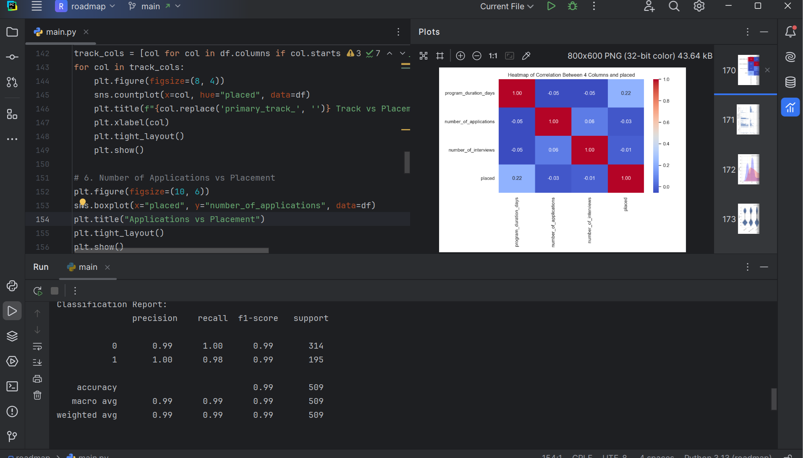

# Roadmap-project-
Examining jobs related to data science using the data of employment companies  in the United States
## 🖼 Sample GUI Preview

# Roadmap-project-

## 📊 Roadmap Project - Data Science Job Analysis

This project analyzes data science job opportunities using real-world employment data from U.S. companies.  
It includes data cleaning, classification, and visualization steps using Python and Pandas.  
Machine learning models were tested to classify job types based on key features.  
The final dataset and results are saved in `.csv` and `.png` formats.  
This project is part of a data science roadmap to showcase practical skills.
